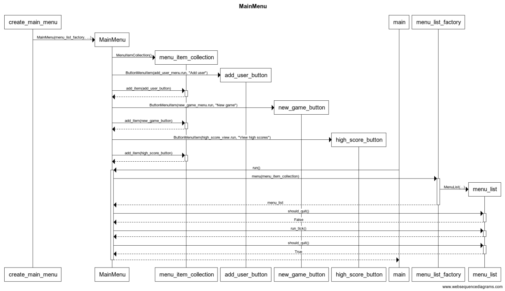
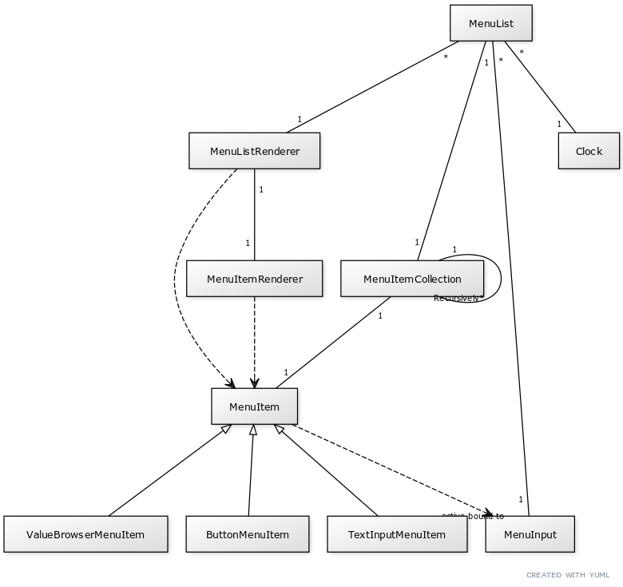
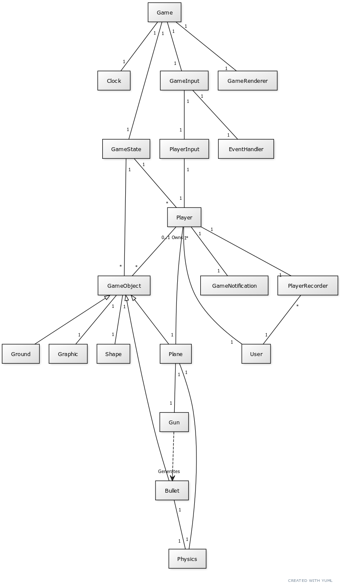

# Architecture description

# Folders
The `src` folder has been divided into `graphics`, `menu`, `game` and `utils`.
Currently there is also some other code which is still directly in `src`.

`src/graphics` contains all code related to drawing content to the screen.
This includes rendering code for game, menu and results.

`src/menu` contains code implementing menu logic and describing menu structure.

`src/utils` contains some small utility classes/functions.

`src/tests` contains the test related code and assets.

Other code that doesn't fit well into these categories is stored directly under `src`.

# Graphics

The most important classes for graphics are `Screen` and `DrawingSurface`.

Screen is used to manage the pygame window, creating new DrawingSurfaces
and to update the screen.

DrawingSurface offers various drawing commands which all work
in the DrawingSurface's realative coordinate space. The relative
coordinate space is useful when combined with the DrawingSurface's
ability to recursively create new (sub)DrawingSurfaces on itself.

## Game rendering

Each renderable object inside the game is represented by a Graphic
class.

The game supports many views. These are rendered with the help
of the Camera class. The Camera can be attached to a DrawingSurface
and implemented transforming (translation, zooming) Graphic objects from
the game world space to the DrawingSurface space.

## Menu rendering

Each menu, represented as a MenuList object, are directly rendered
to the DrawingSurface.

# Menu

The game has three different menus: `MainMenu`, `NewGameMenu` and `AddUserMenu`
defined in the `menu/menus.py`. These are generated by `create_main_menu` function
in `src/menu/setup.py`.

Internally these menus organize various MenuItem objects into MenuItemCollections
which are then made into a MenuList class. The MenuItemCollections
can contain both other MenuItemCollections and MenuItems which makes
it easier to implement for example the varying number of player selector
menu items in `NewGameMenu`.

## MenuList

A MenuList object manages the menu rendering, MenuInput and a collection of
MenuItem objects.

MenuItems provide an interface through which the player's
actions in the menu interact with part of the software. Each
MenuInput object is associated with some callback functions which
are then subsequently associated with the MenuInput when the MenuInput
object is activated.

# Databases

The user and game statistics information is stored in an SQLite database.

## Users

The table `Users` entires correspond to `User` objects and are accessed
with `UserDao` objects. Note that the `User` class is different
from the `Player` class. A `User` object can participate in
many `Game`s and therefore be associated with many `Player` objects
(even inside a single `Game`).

## Statistics
The entries of the table `RoundStatistics` correspond to the statistics
for a single participation of `User` in a `Game`. Statistics are
accessed with the `StatsDao`.

# Game

A single round of the game is represented by `Game` class. The `Game` class
runs the game loop and manages `GameInput` and `GameState`.

## GameState

The `GameState` class manages updating the `Player`s and `GameObject`s states.
The class also manages updating the `GameObject`s present in the game and
their interaction with each other.

## Player

`Player` class is the entity acting as a owner for a single `Plane` (at a time)
and other `GameObject`s. `Player` manages the spawning of new `Planes`
to be owned by the `Player`. The ownership of `GameObject`s allows rewarding
`Players` with points when `GameObject`s interact with each other.

## GameObjects

All interactable objects in the game are derived from the `GameObject` class.
These interactions are managed by the `GameState` class as shown in the following
sequence diagram.

`GameObject`s can be either alive or dead. Only alive `GameObject`s
can interact with other objects. `GameObject`s can also collide with
each other possibly damaging the other object. During the collision
`GameObject`s can also interact by granting reward point to the
`GameObject` inflicting the damage.

New `GameObject`s can be created to the `GameState` either by `Player`
classes or by other `GameObject`s.

## Physics

The game physics (how the GameObjects move) are implemented using the Decorator
pattern. `BasePhysics` defines the basic physical properties and then
Decorators derived from `PhysicsDecorator` can be added to it.

The `Plane`'s physics are made of `BasePhysics`, `BodyPhysics`, `WingPhysics`
and `PhysicsController` while `Bullet`'s physic are made of only
`BasePhysics` and `BodyPhysics`. The decorator pattern allows extending
the physics easily in the future. For example, a missile class could
have `BasePhysics`, `BodyPhysics` and `EnginePhysics` (not implemented).

# Configuration

Many properties of the game can be configured by configuration files.

The configuration files are read into configuration classes which
are all accessible through the Config class.

The main principle behind the configuration classes is that
they should only contain very simple data members (scalars,
pygame.Vector2, tuples) or other configuration classes.

Unfortunately this is currently violated by the LevelConfig class,
which can also create GameObjects, as well as by the
LevelConfigSelector class which is used to select a LevelConfig.

# Things that could be improved

Although most of the parameters in the application are configurable
either through menus or configuration files, there are still some
hard coded constants left in application at least
in the menus and statistics rendering.

Some factory functions are too long. The `Config` class could
also be split into smaller classes.

Graphic and Shape classes are suspiciously similar.
