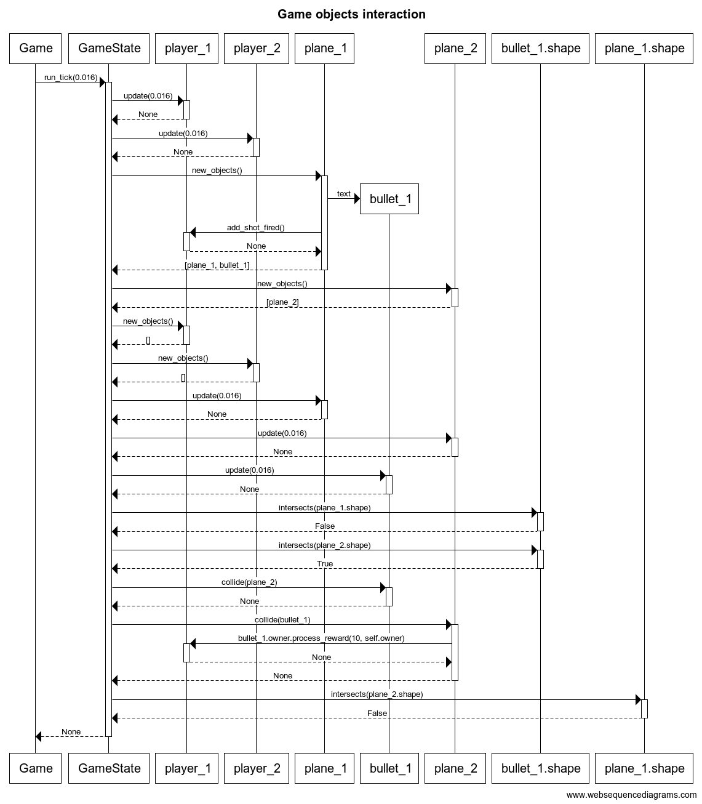

# Architecture description

# Folders
The `src` folder has been divided into `graphics`, `menu`, `game` and `utils`.
Currently there is also some other code which is still directly in `src`.

`src/graphics` contains all code related to drawing content to the screen.
This includes rendering code for game, menu and results.

`src/menu` contains code implementing menu logic and describing menu structure.

`src/utils` contains some small utility classes/functions.

# Storage

The user information is stored in an SQLite database.

# Graphics

The most important classes for graphics are `Screen` and `DrawingSurface`.

Screen is used to manage the pygame window, creating new DrawingSurfaces
and to update the screen.

DrawingSurface offers various drawing commands which all work
in the DrawingSurface's realative coordinate space. The relative
coordinate space is useful when combined with the DrawingSurface's
ability to recursively create new (sub)DrawingSurfaces on itself.

## Game rendering

Each renderable object inside the game is represented by a Graphic
class.

The game supports many views. These are rendered with the help
of the Camera class. The Camera can be attached to a DrawingSurface
and implemented transforming (translation, zooming) Graphic objects from
the game world space to the DrawingSurface space.

## Menu rendering

Each menu, represented as a MenuList object, are directly rendered
to the DrawingSurface.

# Menus

Currently menus are initialized mostly in the main.py but this will change
in the future.

The game has three different menus: `MainMenu`, `NewGameMenu` and `AddUserMenu`
defined in the `menu/menus.py`.

All of these are based on the MenuList class. A MenuList object manages
the menu rendering, MenuInput and a collection of MenuItem objects.

MenuItems provide an interface through which the player's
actions in the menu interact with part of the software. Each
MenuInput object is associated with some callback functions which
are then subsequently associated with the MenuInput when the MenuInput
object is activated.

# Game

## Interaction of game objects

