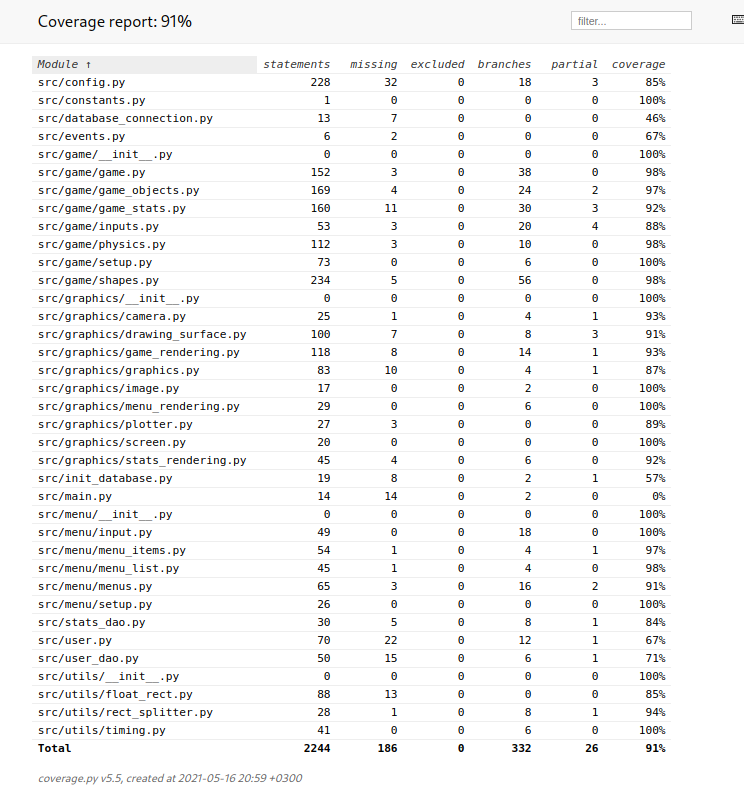
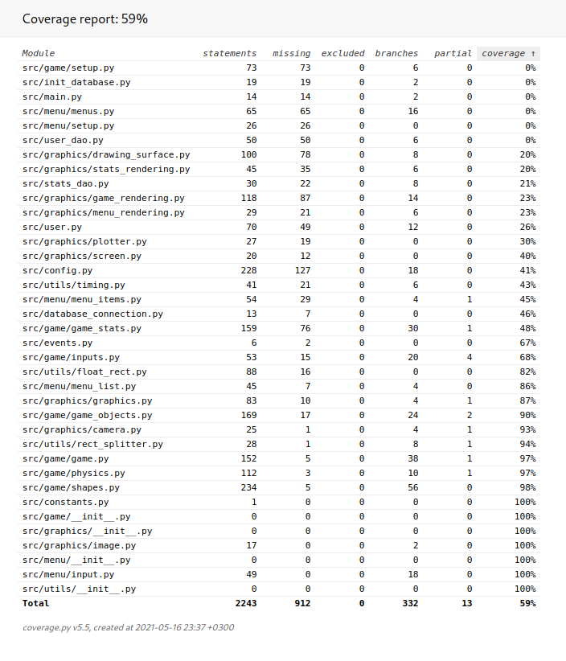

# Testing documentation

The program has been tested with automated unit and integration testa and manually.

## Unit and integration testing
### Unit tests
The unit tests were concentrated on the classes related to game logic.
These include `src/game/game.py`, `src/game/shapes.py`, `src/game/physics.py`
and `src/game/game_objects.py` (see the test coverage for only unit tests).
Low level drawing
code and game ui code was not tested with unit tests.

### System/Integration tests
The menus were mostly tested by system testing by mocking only the `EventHandler` class.
The `GameFactory` class was similarly mostly only tested with integration tests.
The database access was also only tested with automated system testing.

### Test coverage

The test branch coverage excluding testing code was 91 %:

If only unit tests were consired, then the coverage was 59 %:
(This can be generated by running `invoke coverage-report-only-unit`)

## Manual testing

The functionalities described in the requirements specification have been tried.

Special care has been paid to the behaviour of Planes and Bullets during the
gameplay to evaluate whether they behave as expected based on the physics of the
game. No problems have been noticed here.

## Quality problems

### Configuration file validation
Some validation but a lot of problems remain. Problems in the JSON syntax don't
show meaningful errors.

### Drawing
Sometimes lines are drawn too long (the ground can be seen flickering). I'm quite
sure this is a pygame bug as modifying the pygame C code seems to help.

Vsync doesn't work so there is a lot of screen tearing. According to pygame
documentation, vsync only works in pygame.SCALED mode which is very slow
on my computer. The screen tearing seems to be the cause of the occasional
jittering of the plane.
